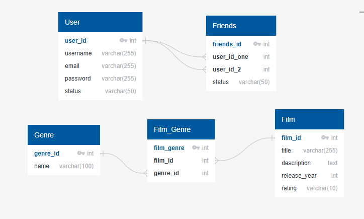

# Filmorate

## Схема базы данных
 

 

- Таблица **User** хранит информацию о пользователях системы.
- Таблица **Film** содержит данные о фильмах.
- Таблица **Genre** содержит жанры фильмов.
- Таблица **Film_Genre** реализует связь многие-ко-многим между фильмами и жанрами.
- Таблица **Friends** хранит информацию о дружеских связях между пользователями, где каждый дружеский запрос или связь имеет статус.

